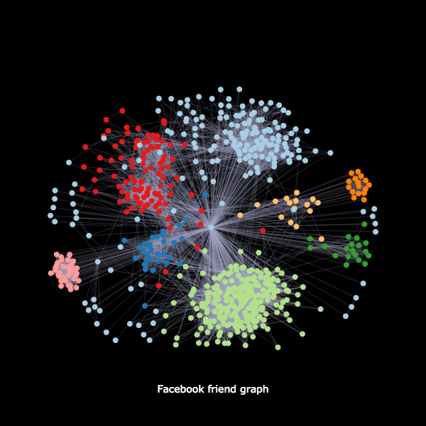

# Facebook friend graph
Plotting your friend network using Plotly, NetworkX and python-louvain

## Result

## Installation

    pip install -r requirements.txt

Install chrome driver [here](https://chromedriver.storage.googleapis.com/index.html?path=2.38/)

## 1 - Scrapping the mutual friends

    python facebookFOF.py

The script will scrappe your mutual friends. It'll periodically save the graph.
So if it crashes just restart it and it'll start where it stopped.

## 2 - Plotting the graph
See the jupyter notebook

## Acknowledgement

Original notebook author: [Lucas Allen](https://twitter.com/lucasallenio), [original code](https://github.com/lgallen/twitter-graph)

Original scrapping code (Python 2) [here](https://github.com/giladravid/FacebookFOF)
